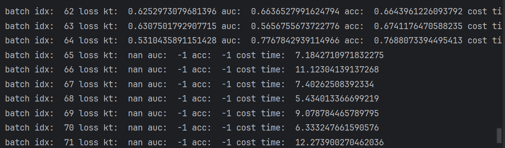

# AIGroup
题记--- 因为这个项目是第一个自己写的项目，所以就在readme里面记录一下，前面几天没记录所以就笼统写一下

前期遇到了很多困难，其实大抵是我后面aiai着a癫狂了，一开始其实是先找的数据集再找的模型，其实这样坐也没错，因为问学长也是这样的，但是可能我有点笨把，突然发现就是我连他给我找的模型都跑不起来，更何谈我自己找数据集去自己跑了。。。

在第一个对于模型自身数据集中跑数据，发现了诸多问题，比如说batch批次大小的问题最终导致我的GPU不够用爆炸了，崩溃，还有说是对于pocessing文件中需要更改的文件读写参数设置引发警告
这些都顺利解决了，其实最大的问题是在于后面不知道为什么突然产生batch idx训练过程中全为-1的情况，其实我也是在这里开始看不懂就在瞎a解决不了问题。然后aiai着都不知道到了哪里，于是重新下载模型进行重做，在这时候我想起了github，我应该好好保存好每一个关键改动时的代码，以免我到时候不知道出现错误在哪里重做的...

如图出现代码全为-1的情况，思考解决方法
1.尝试降低学习率
学习率降低为0。0001，重新跑代码
ps: 梯度爆炸和学习率的关系，如果学习率下降到1e-6还出现梯度爆炸，说明梯度爆炸和学习率无关，则继续排查下一个问题

设置为1e-3仍然发现梯度爆炸，则一步到位设置学习率为1e-6，看此次是否发生梯度爆炸

发现仍然产生梯度爆炸，说明这个问题与学习率无关，回调学习率到0.001

